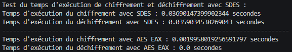
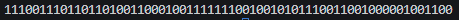

<h1>
SAE Crypto : Défi 2
</h1>

Le groupe est composé des membres suivants : 

MASERATI Amaël

GRATADE Sébastien

Groupe des membres : 

21B

# Partie 1

## Question 1 : 

Le chiffremement RSA comprend plusieurs étapes : la génération de clé, le chiffrement et le déchiffrement. La génération de clé commence par la génération de deux nombres premiers p et q aléatoires et secrets, pour ensuite pouvoir calculer leur produit nommé n. Ensuite, on calcule phi(n) que l'on nomme N, et qui correspond à l'indicatrice d'Euler de n dont le calcul est : phi(n) = (p-1)(q-1). Un entier e est ensuite choisit de sorte à ce que ce dernier et N soient premiers entre eux, ce qui correspond à PGCD(e, N) = 1. On transmet alors la clé publique RSA(e,n). Il faut par la suite calculer d, qui correspond à l'inverse modulaire de e modulo N, c'est-à-dire que si on multiplie e par d modulo N, on obtient 1. La clé privée est donc générée.

En supposant que toutes ces étapes soient correctement utilisées, Eve aura besoin d'un temps considérable pour en venir à bout car un problème intervient, qui est la factorisation de nombres premiers. En l'occurrence, Eve devra factoriser n pour pouvoir trouver p et q, ce qui est un problème difficile à résoudre. Elle aura donc énormément de mal à trouver d en testant toutes les valeurs possibles pour ce dernier.

## Retrouver des clés 

Pour retrouver des clés, il a fallu différentes étapes. Tout d'abord, il faut prendre en compte l'information donnée dans le sujet, qui est que le code de SDES ne permet d'encoder qu'un seul bloc de 8 bits, correspondant à 1 octet. Nous avons donc fait une fonction qui permet de convertir une chaîne de caractères en liste de nombres décimaux par rapport à la valeur d'une lettre en ASCII. Voici à quoi ressemble la fonction : 

Ensuite, il faut faire une fonction de chiffrement SDES simple avec un message et une clé, renvoyant une liste de nombre décimaux : 

On suit cela par une fonction de déchiffrement SDES simple avec en paramètres une liste représentant les bits du message chiffré et une clé, renvoyant à son tour une liste de nombre décimaux : 

On fait de même pour le chiffrement et le déchiffrement SDES double, avec les mêmes paramètres et renvoyant une liste de nombre décimaux :

Par la même occasion, on a fait une fonction qui permet de convertir une liste de bits déchiffrés en chaîne de caractères : 

Arrive alors la fonction qui teste toutes les possibilités de clés de déchiffrements pour retrouver un message clair à partir d'un message chiffré. Voici comment nous avons implémenté cette fonction : 

Comme méthode fonctionne, mais elle peut devenir très long selon les clés utilisées pour le chiffrement si elles sont grandes, et si le message chiffré est long aussi. Il a donc fallu trouver une méthode de cassage plus astucieuse. Voici à quoi ressemble la fonction : 

Cette fonction est plus rapide tout d'abord par sa complexité, qui n'utilise pas de double boucle for en O(N²) mais plutôt deux boucles for distinctes en O(N). Pour commencer, nous créons un dictionnaire qui contiendra en clé la liste des bits du message chiffré, et en valeur la clé. D'ailleurs, comme on ne peut pas mettre une liste en clé de dictionnaire avec python, nous les avons converties en tuples. Nous remplissons donc le dictionnaire avec la fonction de chiffrement SDES simple comme il n'y a qu'une clé. Lorsque le dictionnaire est complet, nous entamons notre deuxième boucle, dans laquelle nous allons tester pour chaque clé un déchiffrement SDES simple. Si le déchiffrement est présent dans les clés de chiffrement, alors nous renvoyons les clés de chiffrement et de déchiffrement correspondantes. Pour finir, pour que ça aille encore plus vite, nous avons pris en compte les dix premiers caractères du message clair et message chiffré seulement car on se dit qu'il est très fiable que lorsque les dix premières parties sont les mêmes, alors le reste le sera aussi.

Nous avons ensuite fait des tests pour comparer le cassage brutal et le cassage astucieux. Tout d'abord, on peut constater que le cassage brutal n'est pas du tout optimisé car pour des clés de 15 et 10 avec un texte assez court, il prend plus de 10 secondes à tout déchiffrer. Voici à quoi ressemble le test :

On peut d'ailleurs constater qu'il y a eu 448 tentatives pour un nombre si petit de clés, ce qui est énorme.

Si on prend le texte du fichier fourni de l'extrait d'Arsène Lupin, le cassage astucieux prend aux alentours de moins d'une seconde à s'appliquer avec une clé de 255 et une clé de 250, ce qui est très rapide.

Le nombre de tentatives a beau être très élevé, on peut constater que c'est extrêment rapide. Le cassage astucieux fait donc bien son travail.

# Partie 2

## Question 1

L'utilisation de l'algorithme AES avec des clés de taille 256 bits à des bons côtés comme des mauvais. Tout d'abord, c'est un bon choix car avec une clé d'une si grande taille, le cassage par force brute serait beaucoup trop long et donc la sécurité est plus assurée comparé à l'agorithme SDES. En revanche, les opérations de chiffrement et de déchiffrement peuvent devenir beaucoup plus longues étant donné que la taille de la clé est bien plus grande, et donc nécessitent plus de ressources pour les calculs qui eux vont prendre plus de temps. Par la même occasion, cela impacte aussi les anciens appareils qui eux n'ont pas la puissance nécessaire pour les opérations à effectuer.

## Question 2

### 2.1

Pour observer les différents temps d'exécution entre les protocoles SDES et AES, nous avons fait des fonctions de chiffrement et de déchifrement AES en utilisant un lien qui nous a été donné dans le sujet. Voici à quoi elles ressemblent :

Nous avons ensuite fait des tests pour le temps d'exécution de ces fonctions. Voici à quoi ressemblent les tests :

Nous obtenons donc les résultats suivants :

Nous pouvons constater que le temps de chiffrement et de déchiffrement du protocole AES est plus rapide que celui du protocole SDES.

### 2.2

Si on prend en compte le nombre de clés possibles avec le protocole AES si on voulait faire un cassage brutal et un cassage astucieux, comme Eve utilise des clés de 256 bits, il y a 2^256 possibilités de clés. En imaginant que le nombre de clés testées par seconde est de 10^9, on peut alors calculer le temps nécessaire pour tester toutes les clés. Nous avons utilisé la fonction timedelta du module datetime qui permet de calculer la différence entre deux dates. On divise donc le nombre de clés par le nombre de clés testées par seconde. Voici à quoi ressemble la procédure : 

Voyons les résultats : 

On peut constater que le temps nécessaire pour tout tester est énorme étant donné le nombre de possibilités. On peut au moins en conclure que le protocole AES est bien plus sécurisé que le SDES.

## Question 3

Il existe comme autres types d'attaques pour tester les différentes possibilités de clés comme l'attaque par analyse fréquentielle. Elle consiste à analyser la fréquence d'apparition des lettres dans un texte chiffré. En se penchant sur ces fréquences, on peut ainsi deviner des parties du message chiffré, et donc de la clé. De plus, il y a l'attaque par clé apparentée. Elle consiste à tester des clés pour en déduire d'autres par rapport à la relation entre des différentes.

## Images

On sait que la clé se trouve dans l'image numéro 2 qui est **rossignol2.bmp**. De ce fait, on va chercher où sont placés les 1 dans les pixels convertis en binaire avec leur position (x,y) dans l'image 1. Par la même occasion, on va afficher le nombre de 1 présents pour voir s'il y a une cohérence, comme on sait que la clé fait 64 bits. Voici à quoi ressemblent la fonction et le résultat donné : 

Voici le résultat donné :

On remarque que les 1 sont tous placés sur la première ligne et qu'ils sont présents dès le premier pixel. De plus, on remarque qu'il y a 33 bits qui valent 1 en base 2, ce qui signifie que c'est cohérent concernant la taille de la clé. On fait donc une fonction qui parcourt la première ligne de l'image 2 avec des valeurs de 0 à 64, et on ajoute la valeur en binaire de chaque pixel à une chaîne de caractère. Voici à quoi ressemblent la fonction et le résultat donné :

